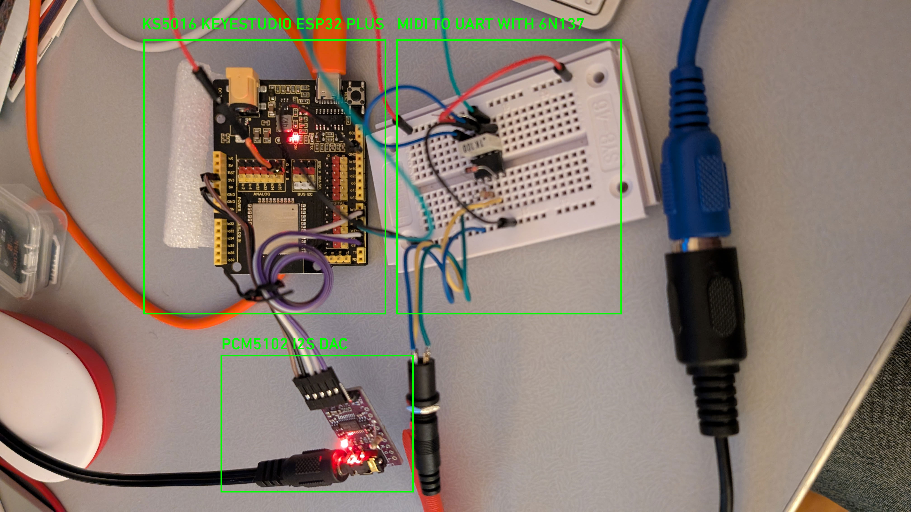
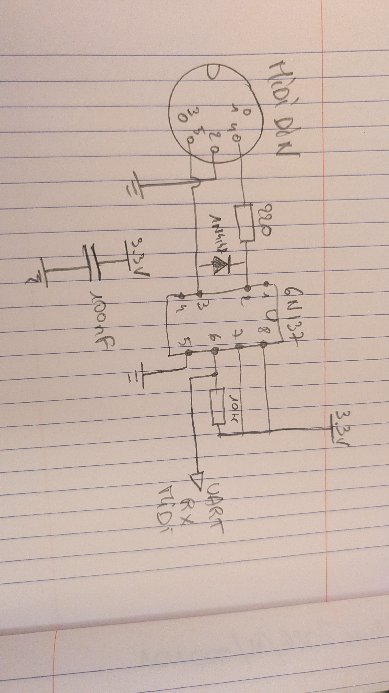

# Struna-14

Struna-14 is a **14-voice polyphonic synthesizer** built around an **ESP32**, designed with a focus on musicality, low CPU usage, and a clean yet expressive timbre inspired by plucked and resonant string instruments.

The synthesis engine is intentionally simple and efficient, relying on sine-based oscillators subtly enriched to achieve brightness and presence without harshness.

[Link to video sample on YouTube](https://youtube.com/shorts/qyLxYTSVYI4?feature=share)

[Link to mp3 audio sample](sample_santa_maria_strela_do_dia.mp3)

---

## Features

- 14-voice polyphony  
- ESP32-based (Arduino framework)  
- **MIDI input (DIN) at 31,250 baud**  
- **Audio output via PCM5102 I²S DAC**  
- Sine oscillator core with controlled harmonic enrichment  
- Plucked-string inspired excitation (noise burst + decay)  
- Subtle inharmonic component for realism  
- Per-voice envelope (attack / exponential decay)  
- Static per-voice detune for width and stability  
- Very low CPU footprint  

---

## Synthesis Overview

Each voice is composed of:

- A primary sine oscillator (fundamental)  
- A secondary inharmonic sine oscillator (very low level)  
- A short noise-based pluck excitation  
- A simple one-pole low-pass filter on the pluck  
- An exponential decay envelope  

A very small sawtooth component is mixed into the sine oscillator to introduce high-frequency energy and improve clarity, while preserving the smooth character of the sine wave.

The overall architecture favors **clarity, articulation, and musical balance** over brute-force spectral density.

---

## MIDI

Struna-14 is controlled via **standard MIDI input**:

- MIDI baud rate: **31,250**
- UART: `Serial2`
- MIDI IN implemented using an **optocoupler (tested with 6N137)**

Supported MIDI functionality:
- Note On / Note Off
- Polyphonic note handling up to 14 voices

The MIDI RX pin is configurable and mapped to a GPIO assigned to `Serial2`.

---

## Audio Output

Audio is generated digitally at **44.1 kHz** and output via an **external PCM5102 DAC** using the ESP32 I²S peripheral.

- DAC: **PCM5102 / PCM5102A**
- Interface: **I²S**
- Output: **mono** (summed internally)
- Internal processing: floating-point

The PCM5102 provides significantly better audio quality than the internal ESP32 DAC and is the recommended output method for Struna-14.

An external analog stage (RC filter / buffer / amplifier) is recommended after the DAC.

---

## Hardware

Typical setup:

- ESP32 (e.g. WROOM-32 DevKit)  
- MIDI IN (DIN 5) via optocoupler (6N137)  
- PCM5102 I²S DAC module  
- Optional analog output stage (filter, buffer, amplifier)

---

## Software

- Language: C++  
- Framework: Arduino (ESP32 core)  
- Sample rate: 44.1 kHz  

The code is structured for clarity and easy experimentation with synthesis parameters (pluck behavior, detune, inharmonicity, envelopes).

---

## Status

Struna-14 is a working and playable synthesizer engine.

Current focus:
- sound voicing and timbral balance  
- articulation and dynamic response  

Possible future additions:
- optional delay / echo  
- simple timbre macro control  
- velocity or MIDI CC modulation  

---

## License

BSD 2-Clause License.

---

Struna-14 is intended as a **musical instrument**, not a DSP showcase.  
The goal is expressiveness, efficiency, and a coherent sonic identity.
